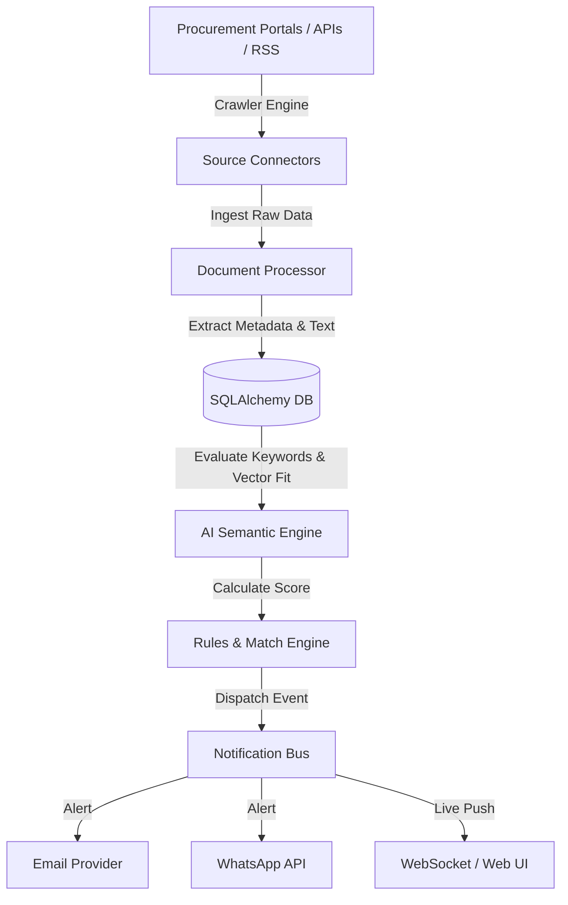

# 🚀 TenderIQ AI Agent - Autonomous Tender & RFP Intelligence Platform

[](https://www.python.org/)
[](https://fastapi.tiangolo.com/)
[](https://www.sqlalchemy.org/)
[](LICENSE)

**TenderIQ AI Agent** is an end-to-end autonomous procurement, RFP search, AI matching, and multi-channel notification platform. It continuously crawls global procurement portals, extracts tender documents, analyzes opportunity fit using LLM-powered semantic scoring, and dispatches real-time alerts and daily digests.

---

## ✨ Key Features

- **🌐 Multi-Source Crawler Engine**: Scrapes and ingests tender opportunities via RSS feeds, REST APIs, and automated Playwright web scrapers (UNGM, TED Europa, RFPdb, etc.).
- **🧠 AI Semantic & Keyword Matching**: Combines high-precision TF-IDF keyword indexing with OpenAI vector-based semantic matching to score tender-to-profile fit (0-100%).
- **📩 Multi-Channel Notification Pipeline**: Real-time notifications via WebSocket, Email (SMTP/Resend), and WhatsApp integration with configurable user rules and daily digest schedules.
- **📊 Interactive Analytics & Dashboard**: Visual metrics for win probabilities, daily opportunity ingestion rates, keyword performance, and organizational activity logs.
- **🛡️ Automated Backups & Integrity Verification**: Scheduled database snapshots, integrity verification engine, and administrative event auditing.
- **📄 Document Processing & Extraction**: Automated extraction of text and metadata from uploaded PDF/Docx tender specifications.

---

## 🏗️ System Architecture



---

## 📁 Repository Structure

```
TenderIQ-AI-Agent/
├── backend/
│   ├── app/
│   │   ├── ai/             # OpenAI provider, semantic matcher, routing
│   │   ├── api/            # FastAPI REST endpoints (tenders, auth, sources, etc.)
│   │   ├── connectors/     # API, RSS, and Playwright crawler connectors
│   │   ├── crawler/        # Async multi-threaded crawler engine
│   │   ├── database/       # SQLAlchemy session & DB initialization
│   │   ├── models/         # Database models (User, Tender, Source, EventLog)
│   │   ├── notifications/  # Email, WhatsApp, and Resend delivery providers
│   │   ├── schemas/        # Pydantic data validation models
│   │   ├── services/       # Event bus, digest generator, scheduler, backup service
│   │   └── utils/          # Security, JWT, encryption, document extraction
│   └── seed.py             # Database seed script
├── static/                 # Frontend SPA assets (JavaScript, CSS, icons)
├── stitch_tenderiq_ai_platform/ # UI pages & components
├── storage/                # Tender documents & automated backup archives
├── tests/                  # Pytest integration & unit test suite
├── scratch/                # Verification and operational helper scripts
├── docker-compose.yml      # Container orchestration
└── Dockerfile              # Container spec
```

---

## 🚀 Quick Start & Installation

### Prerequisites
- Python 3.11 or higher
- Node.js (optional, for Playwright dependencies)

### Setup Instructions

1. **Clone the repository**:
   ```bash
   git clone https://github.com/suyash-acharya-369/TenderIQ-AI-Agent.git
   cd TenderIQ-AI-Agent
   ```

2. **Create and activate a virtual environment**:
   ```bash
   python -m venv venv
   # On Windows:
   venv\Scripts\activate
   # On Linux/macOS:
   source venv/bin/activate
   ```

3. **Install dependencies**:
   ```bash
   pip install -r requirements.txt
   ```

4. **Environment Setup**:
   Copy `.env.example` to `.env` and fill in your API credentials:
   ```bash
   cp .env.example .env
   ```

5. **Run Database Migrations & Seed**:
   ```bash
   python -m backend.app.seed
   ```

6. **Start the Development Server**:
   ```bash
   uvicorn backend.app.main:app --reload --port 8000
   ```
   Access the web interface at `http://127.0.0.1:8000`.

---

## 🧪 Running Tests

Run the full automated test suite with `pytest`:
```bash
pytest tests/ -v
```

---

## 🛠️ Tech Stack

- **Backend**: FastAPI, SQLAlchemy (Async), Pydantic v2, Pytest
- **AI & Analytics**: OpenAI API, NumPy, Scikit-Learn
- **Scraping**: Playwright, BeautifulSoup4, Feedparser
- **Frontend**: Vanilla JavaScript (ES6+), CSS3, HTML5
- **Database**: SQLite (Async engine)

---

## 📜 License

Distributed under the MIT License. See `LICENSE` for more information.
